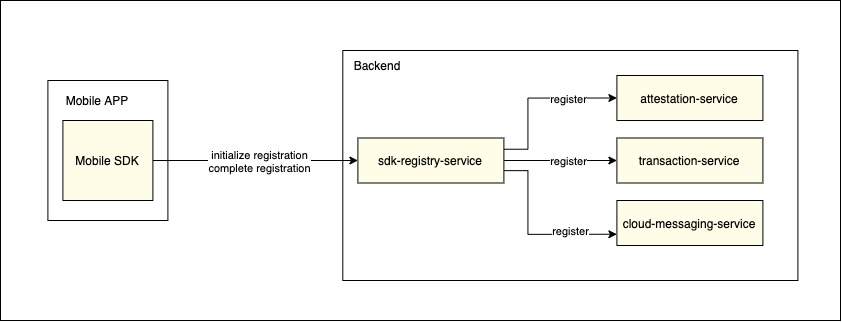
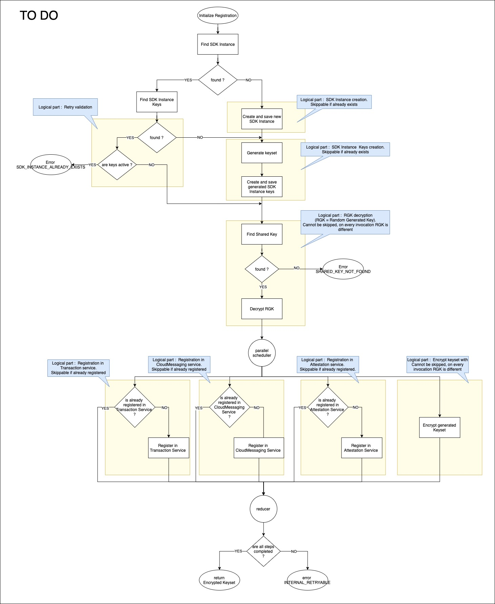

# Senior Java Developer test

##### Estimated execution time: 8h

### Software solution info

Solution enables sending card payment transactions from Android devices. Full software solution consists of 2 main parts :

- Mobile SDK (out of scope)
  -- Embeddable SDK which allows to Mobile Application make payment transactions
- Backend services -- Mobile SDK lifecycle management and transactions processing

Backend consists of several microservices that communicate via HTTP. Backend tech stack :

* Spring Boot Webflux
* Project Reactor
* R2DBC
* Liquibase

### Problem description

The test task is a lightweight version of a real task. During the first development iteration, the back-end team implemented a "happy path"
for registering the Mobile SDK.
"Happy path" does not assume that something may go wrong. This is acceptable for an isolated test environment, but not for the real world.
Microservices carry various problems, in particular, each external call is a potential point of failure. In the real world lots of things
happens, like

* Mobile SDK does not receive a response due to slow connection.
* Some backend service is down
* Timeouts between backend services due to increased load
* Eventual bugs

At the moment, the backend cannot process repeated registration attempts and perceives them as duplicates. Nothing remains for the Mobile
SDK except reinstalling with a new registration. This makes the Mobile SDK unusable, no one wants to reinstall it if registration fails. We
need to improve our registration process. Backend must be able to process repeated registrations multiple times. In the code you will find
prepared integration tests : `InitializeRegistrationRetriesIntegrationTest`
You will see 6 failing integration tests. These tests should pass once flow with retries is implemented.

To solve the problem, you can do absolutely everything that you consider necessary :

* Code refactoring
* Adding new tables and columns in database
* Using other technologies (frameworks, caching, circuit-breakers, retry strategies)
* ... whatever you want ...

### Services

### Diagrams

You can find these diagrams in a directory .github/hometask.drawio

| Current | TO DO |
| :---: | :---: |
|  |  |
